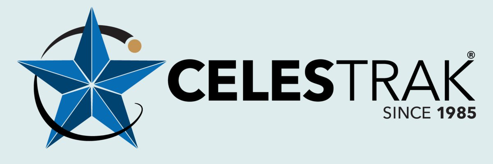

# openc3-cosmos-celestrak

An OpenC3 COSMOS plugin that retrieves Orbit Mean-Elements Message (OMM) data from the [CelesTrak GP API](https://celestrak.org/) in JSON format.

## Plugin Variables

| Variable | Default | Description |
|---|---|---|
| `target_name` | `CELESTRAK_OBJECT` | Target name for the CelesTrak object |
| `celestrak_hostname` | `celestrak.org` | CelesTrak API hostname |
| `celestrak_protocol` | `https` | Protocol for CelesTrak API |
| `celestrak_port` | `443` | Port for CelesTrak API |
| `catalog_number` | `25544` | NORAD catalog number (default is ISS) |
| `poll_period` | `43200` | Polling interval in seconds (12 hours, 0 to disable) |

## Commands

- **GET_OMM** - Fetches the latest OMM data for the configured NORAD catalog number

## Telemetry

- **OMM_RESPONSE** - Satellite identification, epoch, Keplerian orbital elements, mean motion derivatives, BSTAR drag, and element set info
- **ERROR_RESPONSE** - Raw HTTP status code and response body when the API returns an error

## CelesTrak Usage Notice

[CelesTrak](https://celestrak.org/) is a 501(c)(3) nonprofit organization providing space data to the public free of charge. For commercial use of CelesTrak data or services, please contact CelesTrak directly at https://celestrak.org/.
